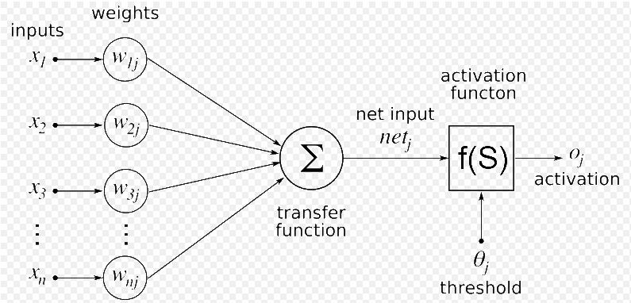

# Neural-Networks-from-Scratch
Building basic neural network from scratch with Python

### Requirements:
* python3
* numpy V1.18.2
* matplotlib V3.2.1
* nnfs latestV

### The Goal of Machine Learning?
> Computers should be able to learn from the experience of the problem they are trying to solve.

### What is Artificial Neural Network (ANN)?
> It is a computational system consisting of graph structure with connection weights and biases that are modifiable using a learning algorithm while
> attempting to mimic the neural connections in our nervous system.


### What is the most important algorithm in NN history?
**Backpropagation** can be considered the cornerstone of modern NNs and deep learning.
1. The _forward pass_ where our inputs are passed through the network and output predictions obtained (also known as the propagation phase)
2. The _backward pass_ where we compute the gradient of the loss function at the final layer of the network and use this gradient to recursively apply the chain rule to update the weights in our network.

```Python
def backPropagation(self, x, y):
        # The first activation is a special case, it's just the input feature vector itself
        A = [np.atleast_2d(x)]

        # Forward pass - loop over the layers of the network
        for layer in np.arange(0, len(self.W)):
           # Weighted sum
           wsum = A[layer].dot(self.W[layer])
           # Activation function
           net = self.sigmoid(wsum)
           # Once we have the net output, add it to our list of acivations
           A.append(net)

        # Backward pass
        error = A[-1]-y
        D = [error * self.sigmoid_deriv(A[-1])]
        
        # Chain Rule
        for layer in np.arange(len(A)-2, 0, -1):
        # The delta for the current layer is equal to the delta of the previous layer D[-1]
        # dotted with the weight matrix of the current layer, followed by multiplying the delta
        # by the derivative of the nonlinear activation function
            delta = D[-1].dot(self.W[layer].T)
            delta = delta * self.sigmoid_deriv(A[layer])
            D.append(delta)
        # Since we looped over our layers in reverse order we need to reverse the deltas
        D = D[::-1]

        # Weight update
        for layer in np.arange(0, len(self.W)):
            self.W[layer] += -self.alpha*A[layer].T.dot(D[layer])
```

### References:
* 3Blue1Brown Youtube channel: https://www.youtube.com/channel/UCYO_jab_esuFRV4b17AJtAw
* Neural networks from scratch e-book: https://nnfs.io/
* Sentdex Youtube channel: https://www.youtube.com/user/sentdex/
* Deep Learning for Computer Vision with Python VOL1 by Dr.Adrian Rosebrock
